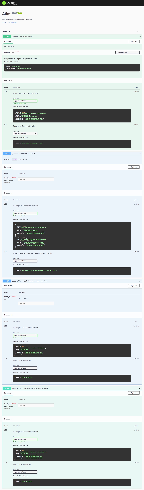

<section align="center">
    <h1>NodeJS Ignite Challenge #4</h1>
</section>

---

<h2 align="center">Summary</h2>

    <a href="#description">📙 Description</a>
    <a href="#tests">⚙️ Tests</a>
    <a href="#documentation">📝 Swagger Documentation</a>
    <a href="#technologies">💻 Technologies</a>

<H2 id="description">📙 Description</H2>

<h3>First part</h3>

Forth challenge from Ignite NodeJS module and it's about an API creation based on the SOLID concepts. The overall structure is pre-made and the task is to fill with the information needed.

This time it was way more challenging than the previous projects because of the amount of new concepts learned on the second chapter. Even though I had support of other people's codes, I got to review tons of things.

Originally created on Ignite from <a href="https://www.rocketseat.com.br/">Rocketseat</a> and made by <a href="https://www.linkedin.com/in/kleverson-kenji-iwatani/">Kenji Iwatani</a>

    <h4><a href="https://www.notion.so/Desafio-01-Introdu-o-ao-SOLID-3b9be286fac0482ca3b275473ddd2d72">Challenge description &rarr;</a></h5>

<h3>Second part</h3>

The second part of this project consisted in documenting all four routes using swagger.io tools. The documentation is available on <a href=http://localhost:3333/api-docs>http://localhost:3333/api-docs</a> after running the local server. You can check the page preview below on <a href="#documentation">this section </a> as well.

Originally created on Ignite from <a href="https://www.rocketseat.com.br/">Rocketseat</a> and made by <a href="https://www.linkedin.com/in/kleverson-kenji-iwatani/">Kenji Iwatani</a>

    <h4><a href="https://www.notion.so/Desafio-02-Documentando-com-Swagger-8ce869ea608743e292851bd951f3239f">Challenge description &rarr;</a></h4>

---

<H2 id="tests">⚙️ Tests</H2>

<h3>Test from model:</h3>

- [x] Should be able to create an user with all props

<h3>Test from repository:</h3>

- [x] Should be able to create new users
- [x] Should be able to list all users
- [x] Should be able to find user by ID
- [x] Should be able to find user by e-mail address
- [x] Should be able to turn an user as admin

<h3>Test from useCases:</h3>

- [x] Should be able to create new users
- [x] Should not be able to create new users when email is already taken
- [x] Should be able to turn an user as admin
- [x] Should not be able to turn a non existing user as admin
- [x] Should be able to get user profile by ID
- [x] Should not be able to show profile of a non existing user
- [x] Should be able to list all users
- [x] Should not be able to a non admin user get list of all users
- [x] Should not be able to a non existing user get list of all users

---

<H2 id="documentation">📝 Swagger Documentation</H2>

<section align="center">
    
</section>

---

<H2 id="technologies">💻 Technologies</H2>

- [x] <a href="https://nodejs.org/en/">NodeJS</a>
- [x] <a href="https://expressjs.com/">ExpressJS</a>
- [x] <a href="https://nodemon.io/">Nodemon</a>
- [x] <a href="https://swagger.io/">Swagger</a>